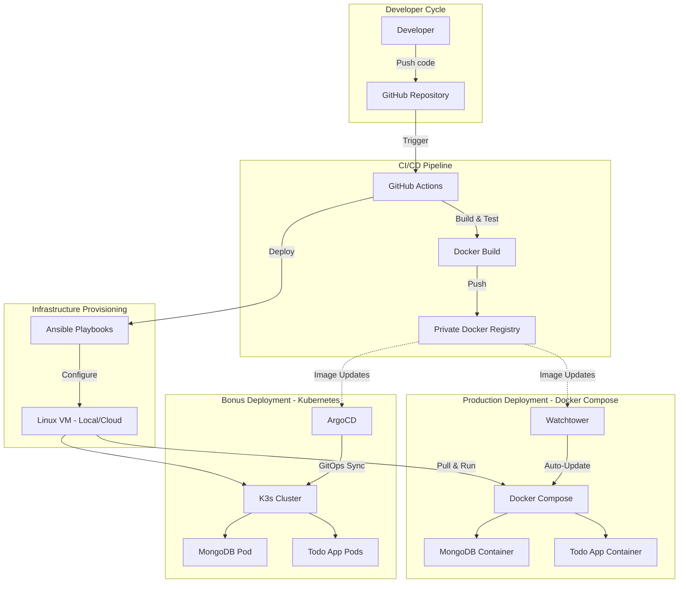

# DevOps Internship Assessment - Todo Application

[](https://github.com/joisyousef/Todo-List-nodejs/actions)

## 📋 Table of Contents

- [DevOps Internship Assessment - Todo Application](#devops-internship-assessment---todo-application)
  - [📋 Table of Contents](#-table-of-contents)
  - [🚀 Overview](#-overview)
  - [🏗️ Architecture](#️-architecture)
  - [🛠️ Prerequisites](#️-prerequisites)
  - [⚡ Quick Start](#-quick-start)
  - [📦 Part 1: Dockerization \& CI Pipeline](#-part-1-dockerization--ci-pipeline)
    - [Docker Implementation](#docker-implementation)
    - [CI/CD Pipeline](#cicd-pipeline)
  - [🔧 Part 2: Infrastructure as Code with Ansible](#-part-2-infrastructure-as-code-with-ansible)
    - [Ansible Structure](#ansible-structure)
    - [Infrastructure Setup](#infrastructure-setup)
  - [🐳 Part 3: Container Orchestration \& Auto-Updates](#-part-3-container-orchestration--auto-updates)
    - [Auto-Update Strategy](#auto-update-strategy)
  - [☸️ Part 4: Kubernetes \& GitOps (Bonus)](#️-part-4-kubernetes--gitops-bonus)
    - [Kubernetes Setup](#kubernetes-setup)
    - [GitOps with ArgoCD](#gitops-with-argocd)
    - [Access Points](#access-points)
  - [🛠️ Technology Stack](#️-technology-stack)
  - [📁 Project Structure](#-project-structure)
  - [🔧 Troubleshooting](#-troubleshooting)
    - [Common Issues and Solutions](#common-issues-and-solutions)
      - [1. Docker Build Failures](#1-docker-build-failures)
      - [2. Ansible Connection Issues](#2-ansible-connection-issues)
      - [3. Container Health Check Failures](#3-container-health-check-failures)
      - [4. Watchtower Not Updating](#4-watchtower-not-updating)
      - [5. Kubernetes Pod Issues](#5-kubernetes-pod-issues)
    - [Log Locations](#log-locations)
  - [🎯 Assessment Completion Checklist](#-assessment-completion-checklist)

## 🚀 Overview

This repository contains a complete DevOps pipeline implementation for the Node.js Todo application assessment, covering all required parts:

- **Part 1 (30 points)**: Containerization with Docker and CI/CD automation via GitHub Actions
- **Part 2 (30 points)**: Infrastructure provisioning using Ansible on a Linux VM
- **Part 3 (40 points)**: Container orchestration with Docker Compose and automated image updates
- **Part 4 (50 points - Bonus)**: Kubernetes deployment and GitOps with ArgoCD

**Base Repository**: Cloned and enhanced from [Ankit6098/Todo-List-nodejs](https://github.com/Ankit6098/Todo-List-nodejs)

## 🏗️ Architecture



## 🛠️ Prerequisites

- **Docker** (v20.10+) and Docker Compose v2+
- **Node.js** (v16+) for local development
- **Git** for version control
- **Ansible** (v4+) for infrastructure automation
- **Linux VM** (local or cloud) with SSH access
- **Private Docker Registry** access (Docker Hub private repo, AWS ECR, etc.)
- **SSH Key** for VM access

## ⚡ Quick Start

```bash
# 1. Clone the repository
git clone https://github.com/joisyousef/Todo-List-nodejs.git
cd Todo-List-nodejs

# 2. Set up environment
cp .env.example .env
# Edit .env with your MongoDB URI and other configurations

# 3. Test locally (optional)
npm install
npm start

# 4. Part 1: Build and test Docker image locally
docker build -t todo-app:local .
docker run -p 4000:4000 --env-file .env todo-app:local

# 5. Part 2: Configure and provision VM
cd ansible
# Edit inventories/hosts.yml with your VM details
ansible-playbook -i inventories/hosts.yml playbooks/site.yml

# 6. Part 3: Deploy with Docker Compose
scp -i YOUR_SSH_KEY.pem docker-compose.yml .env ec2-user@YOUR_VM_IP:/opt/todo-app/
ssh -i YOUR_SSH_KEY.pem ec2-user@YOUR_VM_IP
cd /opt/todo-app
docker-compose up -d

# 7. Access your application
# Visit: http://YOUR_VM_IP:4000

# 8. Part 4 (Bonus): Kubernetes deployment
ansible-playbook -i inventories/hosts.yml playbooks/kubernetes-setup.yml
kubectl port-forward -n todo-app svc/todo-app-service 31159:80
# Then visit: http://localhost:31159
```

---

## 📦 Part 1: Dockerization & CI Pipeline

### Docker Implementation

- **Multi-stage Dockerfile** using `node:18-alpine` for optimized image size
- **Production-ready configuration** with `NODE_ENV=production`
- **Health checks** implemented on `/health` endpoint
- **Security best practices** with non-root user and minimal attack surface
- **Comprehensive .dockerignore** excluding development files and secrets

### CI/CD Pipeline

- **GitHub Actions workflow** (`.github/workflows/ci.yml`)
- **Automated testing** before image build
- **Multi-architecture builds** (linux/amd64, linux/arm64)
- **Automatic tagging strategy**:
  - `sha-<GITHUB_SHA>` for specific commits
  - `latest` for main branch
- **Private registry push** with secure authentication
- **Test artifacts** uploaded for review

## 🔧 Part 2: Infrastructure as Code with Ansible

### Ansible Structure

- **Role-based organization** under `ansible/roles/docker-setup`
- **Inventory management** in `ansible/inventories/hosts.yml`
- **Idempotent playbooks** ensuring consistent state
- **Handler-driven services** for efficient resource management

### Infrastructure Setup

- **Docker Engine** installation and configuration
- **Docker Compose** plugin setup
- **User management** (adding user to docker group)
- **Firewall configuration** for required ports (22, 4000, 31159)
- **System services** configuration and enablement
- **Security hardening** with proper permissions

## 🐳 Part 3: Container Orchestration & Auto-Updates

### Auto-Update Strategy

**Tool Choice: Watchtower**

**Justification:**

- **Simplicity**: Easy to configure and maintain
- **Docker-native**: Seamless integration with Docker Compose
- **Lightweight**: Minimal resource overhead
- **Reliability**: Proven solution with active community support
- **Flexibility**: Configurable polling intervals and update policies

**Alternative Considered**: Custom shell scripts with cron, but Watchtower provides better error handling and logging.

## ☸️ Part 4: Kubernetes & GitOps (Bonus)

### Kubernetes Setup

- **K3s deployment** on the VM for lightweight Kubernetes
- **Namespace isolation** for the todo application
- **ConfigMap** for environment configuration
- **Persistent volumes** for MongoDB data
- **NodePort services** for external access
- **Resource limits** and requests for optimal performance

### GitOps with ArgoCD

- **ArgoCD installation** via Ansible automation
- **Application CRD** for declarative deployment management
- **Git-based synchronization** with automatic updates
- **Web UI access** for monitoring and management
- **Health status monitoring** with visual dashboards

### Access Points

- **ArgoCD UI**: `http://YOUR_VM_IP:30080`
  - Username: `admin`
  - Password: Retrieved via `kubectl get secret argocd-initial-admin-secret`
- **Todo Application**: `http://YOUR_VM_IP:31159`

## 🛠️ Technology Stack

| Component              | Technology              | Purpose                    |
| ---------------------- | ----------------------- | -------------------------- |
| Application Runtime    | Node.js 18 / Express    | Backend application server |
| Database               | MongoDB 5.0             | Document storage           |
| Template Engine        | EJS                     | Server-side rendering      |
| Containerization       | Docker                  | Application packaging      |
| CI/CD                  | GitHub Actions          | Automated pipeline         |
| Registry               | Private Docker Registry | Image storage              |
| Infrastructure         | Ansible                 | Configuration management   |
| Orchestration (Part 3) | Docker Compose          | Container orchestration    |
| Orchestration (Part 4) | K3s Kubernetes          | Advanced orchestration     |
| GitOps                 | ArgoCD                  | Continuous delivery        |
| Auto-Updates           | Watchtower              | Image update automation    |

## 📁 Project Structure

```
├── .github/
│   └── workflows/
│       └── ci.yml              # GitHub Actions CI pipeline
├── ansible/                    # Infrastructure as Code
│   ├── ansible.cfg
│   ├── inventories/
│   │   ├── group_vars/
│   │   └── hosts.yml           # VM inventory
│   ├── playbooks/
│   │   ├── kubernetes-setup.yml
│   │   └── site.yml            # Main playbook
│   └── roles/
│       └── docker-setup/       # Docker installation role
├── argocd/
│   └── todo-app-application.yml # ArgoCD application definition
├── k8s/
│   └── app/                    # Kubernetes manifests
│       ├── configmap.yml
│       ├── mongo-deployment.yml
│       ├── namespace.yml
│       └── todo-app-deployment.yml
├── assets/                     # Frontend assets
├── config/                     # Application configuration
├── controllers/                # Route controllers
├── models/                     # Data models
├── routes/                     # API routes
├── views/                      # EJS templates
├── docker-compose.yml          # Docker Compose configuration
├── Dockerfile                  # Multi-stage Docker build
├── .env.example               # Environment template
├── .dockerignore              # Docker ignore rules
├── package.json               # Node.js dependencies
└── README.md                  # This file
```

## 🔧 Troubleshooting

### Common Issues and Solutions

#### 1. Docker Build Failures

```bash
# Check Docker daemon status
sudo systemctl status docker

# Rebuild with no cache
docker build --no-cache -t todo-app:local .
```

#### 2. Ansible Connection Issues

```bash
# Test connectivity
ansible -i inventories/hosts.yml todo_servers -m ping

# Debug SSH connection
ssh -vvv -i YOUR_SSH_KEY.pem ec2-user@YOUR_VM_IP
```

#### 3. Container Health Check Failures

```bash
# Check container logs
docker-compose logs todo-app

# Manually test health endpoint
curl http://YOUR_VM_IP:4000/health
```

#### 4. Watchtower Not Updating

```bash
# Check Watchtower logs
docker-compose logs watchtower

# Force update check
docker exec -it watchtower_container_name watchtower --run-once
```

#### 5. Kubernetes Pod Issues

```bash
# Check pod status
kubectl get pods -n todo-app

# Check pod logs
kubectl logs -n todo-app deployment/todo-app-deployment

# Describe pod for events
kubectl describe pod -n todo-app POD_NAME
```

### Log Locations

- **Application logs**: `docker-compose logs todo-app`
- **System logs**: `/var/log` on the VM
- **Ansible logs**: Console output during playbook execution
- **ArgoCD logs**: ArgoCD UI → Applications → todo-app → Logs

---

## 🎯 Assessment Completion Checklist

- ✅ **Part 1**: Docker containerization with multi-stage build
- ✅ **Part 1**: GitHub Actions CI pipeline with private registry push
- ✅ **Part 2**: Linux VM setup (local/cloud)
- ✅ **Part 2**: Ansible automation for Docker installation
- ✅ **Part 3**: Docker Compose orchestration with health checks
- ✅ **Part 3**: Automated image updates with Watchtower
- ✅ **Part 4**: Kubernetes deployment with K3s
- ✅ **Part 4**: ArgoCD GitOps implementation
- ✅ **Documentation**: Comprehensive README with no secrets
- ✅ **Security**: All sensitive data in environment variables
