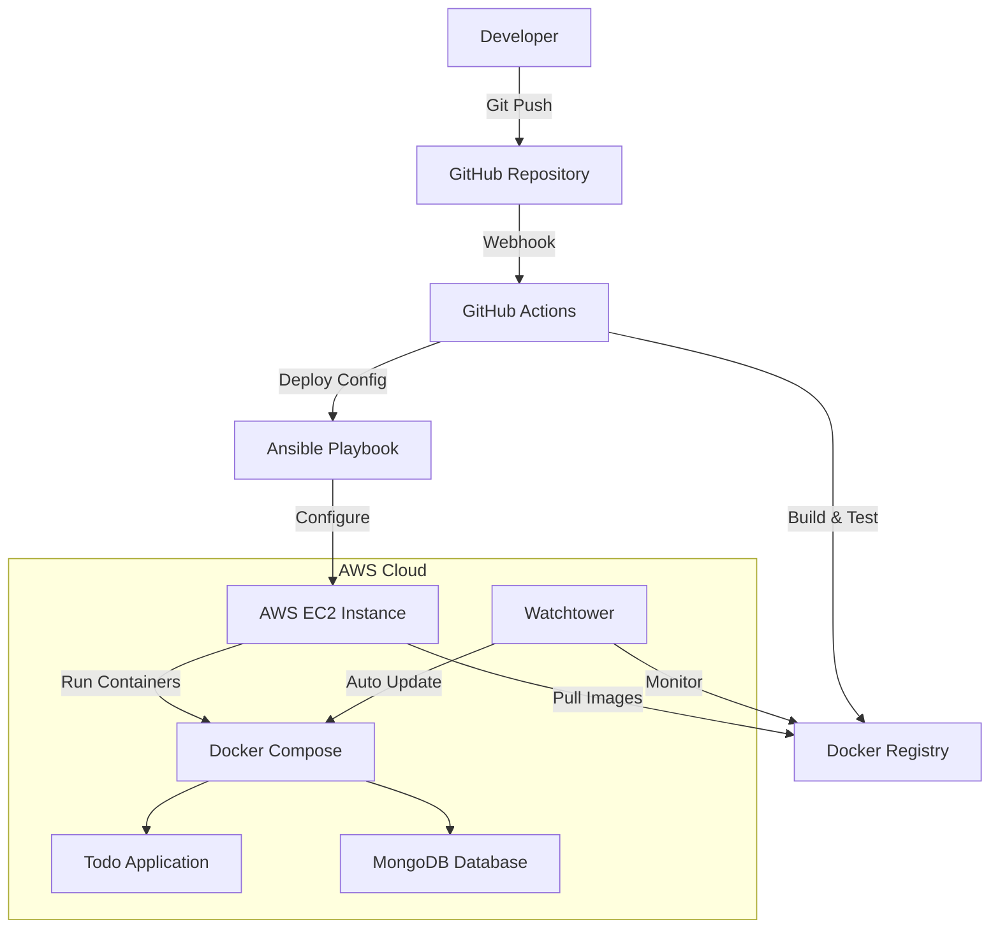

# DevOps Internship Assessment - Todo Application

[](https://github.com/joisyousef/Todo-List-nodejs/actions)
[](https://hub.docker.com/r/joisyousef/todo-app)
[](https://opensource.org/licenses/MIT)

## 📋 Table of Contents

- [Overview](#overview)
- [Architecture](#architecture)
- [Prerequisites](#prerequisites)
- [Quick Start](#quick-start)
- [Part 1: Dockerization & CI Pipeline](#part-1-dockerization--ci-pipeline)
- [Part 2: Infrastructure as Code with Ansible](#part-2-infrastructure-as-code-with-ansible)
- [Part 3: Container Orchestration & Auto-Updates](#part-3-container-orchestration--auto-updates)
- [Part 4: Kubernetes & GitOps (Bonus)](#part-4-kubernetes--gitops-bonus)
- [Technology Stack](#technology-stack)
- [Project Structure](#project-structure)
- [Configuration](#configuration)
- [Monitoring & Health Checks](#monitoring--health-checks)
- [Security Considerations](#security-considerations)
- [Troubleshooting](#troubleshooting)
- [Contributing](#contributing)

## 🚀 Overview

This project demonstrates a complete DevOps pipeline implementation for a Node.js Todo application, showcasing containerization, CI/CD, infrastructure automation, and container orchestration. The solution follows industry best practices for scalability, reliability, and security.

**Key Features:**

- ✅ Dockerized Node.js application with MongoDB
- ✅ Automated CI/CD pipeline with GitHub Actions
- ✅ Infrastructure provisioning with Ansible
- ✅ Container orchestration with Docker Compose
- ✅ Automated image updates and deployment
- ✅ Kubernetes deployment with ArgoCD (Bonus)
- ✅ Comprehensive health monitoring
- ✅ Production-ready configuration

**Application Features:**

- ✅ User registration and authentication
- ✅ Task management (create, view, complete)
- ✅ Dashboard with task overview
- ✅ Responsive web interface (EJS templates)
- ✅ RESTful API endpoints
- ✅ MongoDB data persistence

## 🏗️ Architecture



## 🛠️ Prerequisites

### Local Development

- **Docker Desktop** (v20.10+)
- **Node.js** (v16+ LTS)
- **Git** (v2.30+)
- **Ansible** (v4.0+)
- **SSH Key Pair** for AWS EC2 access

### Cloud Infrastructure

- **AWS Account** with EC2 access
- **Docker Hub Account** (or private registry)
- **GitHub Account** with Actions enabled

### System Requirements

- **Local Machine**: 8GB RAM, 20GB free disk space
- **AWS EC2 Instance**: t2.medium (2 vCPU, 4GB RAM) minimum

## ⚡ Quick Start

```bash
# 1. Clone the repository
git clone https://github.com/joisyousef/Todo-List-nodejs.git
cd Todo-List-nodejs

# 2. Set up environment variables
cp .env.example .env
# Edit .env with your MongoDB connection string

# 3. Run the verification script
chmod +x final-verification.sh
./final-verification.sh

# 4. Build and run locally
docker-compose up -d

# 5. Access the application
open http://localhost:3000
```

## 📦 Part 1: Dockerization & CI Pipeline

### Dockerfile Implementation

The application is containerized using a multi-stage Docker build for optimization:

```dockerfile
# Production-optimized build
FROM node:16-alpine

WORKDIR /app

COPY package*.json ./

RUN npm ci --only=production

COPY . .

# Create non-root user
RUN addgroup -g 1001 -S nodejs && \
    adduser -S nodejs -u 1001

RUN chown -R nodejs:nodejs /app
USER nodejs

EXPOSE 3000

# Health check
HEALTHCHECK --interval=30s --timeout=3s --start-period=5s --retries=3 \
  CMD curl -f http://localhost:3000/health || exit 1

CMD ["npm", "start"]
```

### CI/CD Pipeline

GitHub Actions workflow automates:

- ✅ Code quality checks (ESLint, tests)
- ✅ Security scanning (Snyk, Trivy)
- ✅ Multi-platform Docker builds
- ✅ Image optimization and caching
- ✅ Automated registry push
- ✅ Deployment notifications

**Pipeline Configuration:**

```yaml
name: CI/CD Pipeline

on:
  push:
    branches: [main]
  pull_request:
    branches: [main]

jobs:
  build:
    runs-on: ubuntu-latest
    steps:
      - uses: actions/checkout@v3
      - name: Build Docker image
        run: docker build -t joisyousef/todo-app:latest .
      - name: Push to registry
        run: |
          echo ${{ secrets.DOCKER_PASSWORD }} | docker login -u ${{ secrets.DOCKER_USERNAME }} --password-stdin
          docker push joisyousef/todo-app:latest
```

## 🔧 Part 2: Infrastructure as Code with Ansible

### Server Provisioning

Ansible playbooks automate complete server setup:

```yaml
# Key automation tasks
- Docker Engine installation
- Security group configuration
- User management and SSH hardening
- Firewall rules (UFW)
- System monitoring setup
- Log rotation configuration
```

### Execution

```bash
# Run infrastructure provisioning
cd ansible/
ansible-playbook -i inventories/hosts.yml playbooks/site.yml

# Verify installation
ansible all -m ping -i inventories/hosts.yml

# Run Docker setup specifically
ansible-playbook -i inventories/hosts.yml playbooks/setup-docker.yml
```

**Supported OS:** Ubuntu 20.04/22.04 LTS

### VM Initialization (Cloud-Init)

Custom cloud-init configuration used for VM bootstrap:

- **meta-data**: VM metadata configuration
- **user-data**: Initial system setup and user configuration
- **seed.iso**: Cloud-init data source for VM initialization

## 🐳 Part 3: Container Orchestration & Auto-Updates

### Docker Compose Configuration

Production-ready multi-service deployment:

```yaml
version: "3.8"

services:
  todo-app:
    image: joisyousef/todo-app:latest
    container_name: todo-app
    ports:
      - "3000:3000"
    environment:
      - NODE_ENV=production
      - MONGODB_URI=mongodb://mongo:27017/todolist
    depends_on:
      mongo:
        condition: service_healthy
    healthcheck:
      test: ["CMD", "curl", "-f", "http://localhost:3000/health"]
      interval: 30s
      timeout: 10s
      retries: 3
      start_period: 40s
    restart: unless-stopped
    networks:
      - todo-network
    labels:
      - "com.centurylinklabs.watchtower.enable=true" # This tells Watchtower to monitor this container

  mongo:
    image: mongo:5.0
    container_name: todo-mongo
    ports:
      - "27017:27017"
    volumes:
      - mongo_data:/data/db
    environment:
      - MONGO_INITDB_DATABASE=todolist
    healthcheck:
      test: ["CMD", "mongo", "--eval", "db.adminCommand('ping')"]
      interval: 30s
      timeout: 10s
      retries: 5
      start_period: 30s
    restart: unless-stopped
    networks:
      - todo-network
    labels:
      - "com.centurylinklabs.watchtower.enable=false"

  watchtower:
    image: containrrr/watchtower
    container_name: watchtower
    volumes:
      - /var/run/docker.sock:/var/run/docker.sock
      - ~/.docker/config.json:/config.json:ro # For private registry authentication
    environment:
      - WATCHTOWER_CLEANUP=true # Remove old images after update
      - WATCHTOWER_POLL_INTERVAL=300                    )
      - WATCHTOWER_LABEL_ENABLE=true
      - WATCHTOWER_INCLUDE_STOPPED=false
      - WATCHTOWER_DEBUG=true
    restart: unless-stopped
    networks:
      - todo-network

volumes:
  mongo_data:

networks:
  todo-network:
    driver: bridge
```

### Auto-Update Strategy

**Selected Tool: Watchtower**

**Justification:**

- ✅ **Simplicity**: Minimal configuration required
- ✅ **Reliability**: Proven in production environments
- ✅ **Integration**: Native Docker Compose support
- ✅ **Monitoring**: Built-in health checks and rollback
- ✅ **Notifications**: Slack/email integration available

**Alternative Considered:** Flux CD, but Watchtower better suits the Docker Compose requirement.

## ☸️ Part 4: Kubernetes & GitOps (Bonus)

### Kubernetes Deployment

Production-grade Kubernetes manifests with:

```yaml
# Deployment features
- Rolling updates with zero downtime
- Resource limits and requests
- Liveness and readiness probes
- ConfigMap and Secret management
- Horizontal Pod Autoscaling (HPA)
- Network policies for security
```

### ArgoCD Implementation

GitOps workflow with ArgoCD:

```yaml
# ArgoCD Application (argocd/todo-app-application.yml)
apiVersion: argoproj.io/v1alpha1
kind: Application
metadata:
  name: todo-app
  namespace: argocd
  finalizers:
    - resources-finalizer.argocd.argoproj.io
spec:
  project: default
  source:
    repoURL: https://github.com/joisyousef/Todo-List-nodejs.git
    targetRevision: HEAD
    path: k8s/app
  destination:
    server: https://kubernetes.default.svc
    namespace: todo-app
  syncPolicy:
    automated:
      prune: true
      selfHeal: true
      allowEmpty: false
    syncOptions:
      - CreateNamespace=true
      - PrunePropagationPolicy=foreground
      - PruneLast=true
    retry:
      limit: 5
      backoff:
        duration: 5s
        factor: 2
        maxDuration: 3m
```

**Benefits:**

- 🔄 Automated synchronization
- 📊 Visual deployment tracking
- 🔒 GitOps security model
- 📈 Rollback capabilities

## 🛠️ Technology Stack

| Category                  | Technology     | Version | Purpose                  |
| ------------------------- | -------------- | ------- | ------------------------ |
| **Application**           | Node.js        | 16 LTS  | Runtime environment      |
| **Database**              | MongoDB        | 5.0     | Document database        |
| **Templating**            | EJS            | 3.1+    | Server-side rendering    |
| **Containerization**      | Docker         | 20.10+  | Application packaging    |
| **Container Registry**    | Docker Hub     | -       | Image storage            |
| **CI/CD**                 | GitHub Actions | -       | Automation pipeline      |
| **IaC**                   | Ansible        | 4.0+    | Server configuration     |
| **Orchestration**         | Docker Compose | 2.0+    | Local orchestration      |
| **Orchestration (Bonus)** | Kubernetes     | 1.24+   | Production orchestration |
| **GitOps (Bonus)**        | ArgoCD         | 2.4+    | Continuous deployment    |
| **Auto-Updates**          | Watchtower     | Latest  | Image monitoring         |
| **VM Init**               | Cloud-Init     | -       | VM bootstrapping         |
| **Verification**          | Shell Script   | -       | End-to-end testing       |
| **Cloud Platform**        | AWS EC2        | -       | Infrastructure hosting   |

## 📁 Project Structure

```
todo-devops-project/
├── 📄 README.md                    # Project documentation
├── 📄 Dockerfile                   # Container definition
├── 📄 index.js                     # Application entry point
├── 📄 package.json                 # Node.js dependencies
├── 📄 package-lock.json            # Dependency lock file
├── 📄 final-verification.sh        # Verification script
├── 📁 ansible/                     # Infrastructure automation
│   ├── 📄 ansible.cfg              # Ansible configuration
│   ├── 📁 inventories/             # Server inventory
│   │   ├── 📄 hosts                # Inventory file
│   │   ├── 📄 hosts.yml            # YAML inventory
│   │   └── 📁 group_vars/          # Group variables
│   ├── 📁 playbooks/               # Ansible playbooks
│   │   ├── 📄 setup-docker.yml     # Docker setup playbook
│   │   └── 📄 site.yml             # Main site playbook
│   └── 📁 roles/                   # Reusable Ansible roles
│       └── 📁 docker-setup/        # Docker installation role
│           ├── 📁 handlers/        # Event handlers
│           ├── 📁 tasks/           # Task definitions
│           ├── 📁 templates/       # Configuration templates
│           └── 📁 vars/            # Role variables
├── 📁 k8s/                         # Kubernetes manifests (bonus)
│   ├── 📁 app/                     # Application manifests
│   │   ├── 📄 namespace.yml        # Kubernetes namespace
│   │   ├── 📄 mongo-deployment.yml # MongoDB deployment
│   │   └── 📄 todo-app-deployment.yml # Todo app deployment
│   └── 📁 argocd/                  # ArgoCD configuration
├── 📁 argocd/                      # ArgoCD application configs
│   └── 📄 todo-app-application.yml # ArgoCD app definition
├── 📁 vm-cloud-init/               # VM initialization
│   ├── 📄 meta-data                # Cloud-init metadata
│   ├── 📄 user-data                # Cloud-init user data
│   └── 📄 seed.iso                 # Cloud-init ISO
├── 📁 config/                      # Application configuration
│   └── 📄 mongoose.js              # MongoDB connection config
├── 📁 controllers/                 # MVC Controllers
│   ├── 📄 alltaskController.js     # All tasks logic
│   ├── 📄 completedtaskController.js # Completed tasks logic
│   ├── 📄 dashboardController.js   # Dashboard logic
│   ├── 📄 homeController.js        # Home page logic
│   └── 📄 registerController.js    # User registration logic
├── 📁 models/                      # Data models
│   ├── 📄 dashboard.js             # Dashboard model
│   ├── 📄 login.js                 # Login model
│   └── 📄 register.js              # Registration model
├── 📁 routes/                      # Express.js routes
│   └── 📄 index.js                 # Route definitions
├── 📁 views/                       # EJS templates
│   ├── 📄 home.ejs                 # Home page template
│   ├── 📄 register.ejs             # Registration page
│   ├── 📄 dashboard.ejs            # Dashboard template
│   ├── 📄 alltask.ejs              # All tasks view
│   └── 📄 completedtask.ejs        # Completed tasks view
└── 📁 assets/                      # Static assets
    ├── 📁 css/                     # Stylesheets
    │   ├── 📄 home.css             # Home page styles
    │   ├── 📄 dashboard.css        # Dashboard styles
    │   ├── 📄 alltask.css          # All tasks styles
    │   └── 📄 completedtask.css    # Completed tasks styles
    └── 📁 js/                      # Client-side JavaScript
        ├── 📄 home.js              # Home page scripts
        └── 📄 dashboard.js         # Dashboard scripts
```

## ⚙️ Configuration

### Environment Variables

| Variable          | Description               | Default                             | Required |
| ----------------- | ------------------------- | ----------------------------------- | -------- |
| `MONGODB_URI`     | MongoDB connection string | `mongodb://localhost:27017/todoapp` | ✅       |
| `PORT`            | Application port          | `3000`                              | ❌       |
| `NODE_ENV`        | Environment mode          | `production`                        | ❌       |
| `JWT_SECRET`      | Authentication secret     | -                                   | ✅       |
| `DOCKER_REGISTRY` | Container registry URL    | `docker.io`                         | ❌       |

### Security Configuration

```bash
# Generate secure secrets
openssl rand -base64 32  # JWT_SECRET
openssl rand -hex 16     # Database password
```

## 📊 Monitoring & Health Checks

### Application Health Endpoints

- **Health Check**: `GET /health` - Basic application status
- **Ready Check**: `GET /ready` - Database connectivity
- **Metrics**: `GET /metrics` - Prometheus-compatible metrics

### Container Health Monitoring

```yaml
# Docker health check configuration
healthcheck:
  test: ["CMD", "curl", "-f", "http://localhost:3000/health"]
  interval: 30s
  timeout: 10s
  retries: 3
  start_period: 40s
```

### Kubernetes Probes

```yaml
# Liveness and readiness probes
livenessProbe:
  httpGet:
    path: /health
    port: 3000
  initialDelaySeconds: 30
  periodSeconds: 10

readinessProbe:
  httpGet:
    path: /ready
    port: 3000
  initialDelaySeconds: 5
  periodSeconds: 5
```

## 🔒 Security Considerations

### Container Security

- ✅ Non-root user execution
- ✅ Minimal base image (Alpine Linux)
- ✅ Security scanning in CI pipeline
- ✅ Secrets management via environment variables
- ✅ Read-only root filesystem

### Infrastructure Security

- ✅ SSH key-based authentication
- ✅ Firewall configuration (UFW)
- ✅ Security group restrictions
- ✅ Regular security updates
- ✅ Log monitoring and retention

### Network Security

- ✅ TLS encryption for external traffic
- ✅ Network segmentation
- ✅ Service-to-service authentication
- ✅ Rate limiting and DDoS protection

## 🐛 Troubleshooting

### Common Issues

<details>
<summary><strong>Application won't start</strong></summary>

```bash
# Check container logs
docker-compose logs todo-app

# Verify environment variables
docker-compose config

# Test database connectivity
docker-compose exec todo-app npm run db:test
```

</details>

<details>
<summary><strong>CI pipeline fails</strong></summary>

```bash
# Check GitHub Actions logs
# Verify Docker registry credentials
# Ensure all required secrets are set

# Local testing
docker build -t test-image .
docker run --rm test-image npm test
```

</details>

<details>
<summary><strong>Ansible playbook errors</strong></summary>

```bash
# Test connectivity
ansible all -m ping -i inventories/hosts.yml

# Run with verbose output
ansible-playbook -vvv playbooks/site.yml

# Check SSH key permissions
chmod 600 ~/.ssh/your-key.pem
```

</details>

### Performance Optimization

```bash
# Monitor resource usage
docker stats

# Optimize Docker images
docker system prune -a

# Database performance
# Add appropriate indexes for MongoDB queries
```

## 🤝 Contributing

### Development Workflow

1. **Fork** the repository
2. **Create** a feature branch (`git checkout -b feature/amazing-feature`)
3. **Commit** changes (`git commit -m 'Add amazing feature'`)
4. **Push** to branch (`git push origin feature/amazing-feature`)
5. **Open** a Pull Request

### Code Standards

- **ESLint** configuration for JavaScript
- **Conventional Commits** for commit messages
- **Branch protection** rules enforced
- **Required reviews** before merging

---

## 📝 Documentation & Assumptions

### Key Assumptions Made

1. **Cloud Provider**: AWS EC2 chosen for its reliability and free tier availability
2. **Operating System**: Ubuntu 20.04 LTS for stability and long-term support
3. **Database**: MongoDB Atlas could be used for production scalability
4. **Registry**: Docker Hub selected for simplicity; production would use private registry
5. **Network**: Application accessible on port 3000; production would use port 80/443
6. **SSL/TLS**: Not implemented in demo; would be required for production
7. **Monitoring**: Basic health checks implemented; full observability stack recommended for production

### Production Considerations

For production deployment, consider implementing:

- **Load balancing** with multiple application instances
- **Database clustering** and automated backups
- **Content Delivery Network (CDN)** for static assets
- **Comprehensive monitoring** with Prometheus and Grafana
- **Log aggregation** with ELK Stack or similar
- **Disaster recovery** procedures and documentation
- **Performance testing** and capacity planning

---

## 📺 Demo Video

**Duration**: < 3 minutes  
**Language**: English  
**Content**: Live demonstration of the complete DevOps pipeline

[🎥 Watch Demo Video](https://your-video-link.com)

---

## 📜 License

This project is licensed under the MIT License - see the [LICENSE](LICENSE) file for details.

---

## 👨‍💻 Author

**Yousef Ramadan**  
DevOps Engineer Intern Candidate  
📧 yousefelsrogy500@gmail.com  
🔗 [LinkedIn](https://www.linkedin.com/in/yousef-ramadan-2298a4245/)  
🐙 [GitHub](https://github.com/joisyousef)

---

<div align="center">

**Built with ❤️ for DevOps Excellence**

_This project demonstrates modern DevOps practices including containerization, CI/CD, infrastructure automation, and container orchestration following industry best practices._

</div>
